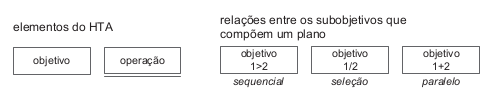

# Lista de exercícios - Organização do Espaço de Problema

1. O que é perfil de usuário?

    É uma descrição detalhada das características dos usuários cujos objetivos devem ser apoiados pelo sistema sendo projetado. Em geral, um perfil de usuário é caracterizado por dados sobre o próprio usuário, dados sobre sua relação com tecnologia, sobre seu conhecimento do domínio do produto e das tarefas que deverá realizar utilizando o produto.

    Uma vez determinadas as faixas de respostas para as características e a porcentagem de usuários nessa faixa, podemos categorizar os usuários em grupos com base em suas semelhanças, por exemplo: por idade (criança, jovem, adulto, terceira idade etc.), atitudes (tecnófilos, tecnófobos) e tarefas primárias (compra, venda).

2. O que é uma persona? Como ela é definida?

    Uma persona é um personagem fictício, que possui características de um grupo de usuários reais, criada para descrever um usuário típico. São definidas principalmente por seus objetivos.

3. Quais são os elementos característicos para definir uma persona?
    Personas possuem os seguintes elementos característicos:

   - Identidade
   - Status (primária, secundária, antiusuário ou outro stakeholder)
   - Objetivos
   - Habilidades
   - Tarefas
   - Relacionamentos
   - Requisitos
   - Expectativas

4. Em quais situações uma persona pode ser utilizada?

    São uma importante ferramenta de design, já que fornecem a base para um design orientado a objetivos. Elas tornam claros os objetivos dos usuários, além de ajudarem a equipe de design a justificar suas decisões para os desenvolvedores e gerentes.

5. Como deve ser a relação entre a persona com a equipe de design?

    A equipe de design não deve apenas conhecer o elenco de personas, mas envolvê-las na equipe como se fossem uma pessoa real. Devem ser tratadas por nome e suas opiniões devem ser levadas em consideração ao elaborar propostas de design.

6. Quantas personas devem consistir o elenco de personas de um projeto?

    Uma recomendação comum é que o elenco inclua três personas.

7. O que são antipersonas?

    Personas definidas para tornar claro quem não é o alvo do sistema sendo projetado.

8. O que é uma persona primária?

    O indivíduo que é o foco principal do design.

9. Quais o cuidado na escolha do número de personas primárias para um projeto?

    É importante que o elenco de personas seja memorável, e por isso, não é recomendado que sejam criadas muitas personas. Cada projeto deve ter ao menos uma persona primária.

10. Escreva sobre Objetivos das Personas.

    Objetivos não são a mesma coisa que tarefas, objetivos são estados finais que serão atingidos por meio de tarefas. As tarefas mudam de acordo com as tecnologias, mas os objetivos apresentam-se mais estáveis. Uma boa tarefa para descobrir os objetivos é realizar sessões de _brainstorming_ considerando um computador mágico, sem restrições.
    Cooper descreve três tipos de objetivos:
        - Pessoais: simples, universais e pessoais. **Exemplos**: manter a dignidade, não se sentir estúpido, não cometer erros, dentre outros.
        - Corporativos: estão relacionados ao negócio em si. **Exemplos**: aumentar lucro, derrotar a concorrência e oferecer mais produtos e serviços.
        - Práticos: conectam os objetivos pessoais e corporativos. **Exemplos**: processar as requisições do cliente conecta o objetivo de maior lucro com o objetivo pessoal do usuário de ser produtivo.
    Uma persona não precisa atingir todos seus objetivos práticos de uma vez, mas não deve ter nenhum de seus objetivos pessoais violado.

    Norman propôs três níveis de processamento cognitivo: visceral, comportamental e reflexivo, com base nos quais definiu três tipos de objetivos do usuário:
        - Objetivos de experiência: como o usuário deseja se sentir, estão relacionados ao processamento cognitivo visceral. **Exemplo**: sentir-se no controle, se divertir e relaxar.
        - Objetivos finais (_end gloas_): o que o usuário deseja fazer, estão relacionados ao processamento cognitivo comportamental. **Exemplo**: manter contato com amigos e familiares, concluir sua lista de tarefas no final de um dia de trabalho e ser notificado de qualquer problema antes que se torne crítico.
        - Objetivos de vida (_life goals_): quem o usuário deseja ser, estão relacionados ao processamento cognitivo reflexivo. **Exemplo**: viver uma boa vida, ter sucesso em suas ambições e se tornar especialista em um determinado assunto.

11. O que são cenários de análise (cenários de problema)?

    Um cenário é uma história sobre pessoas realizando uma atividade. É uma narrativa textual ou pictórica, concreta, rica em detalhes contextuais, de uma situação de uso da aplicação, envolvendo usuários, processos e dados reais ou potenciais.

    Descrevem o comportamento e experiência dos atores, cada ator possui objetivos que dirigem as tarefas que ele realiza. Possui um enredo, que inclui sequências de ações e eventos: que os usuários fazem, o que acontece com eles, que mudanças ocorrem no ambiente, e assim por diante.

    Compõe-se de:
        - Título: descrição breve da situação;
        - Ambiente ou contexto: detalhes da situação que motivam ou explicam os objetivos, ações e reações dos atores;
        - Atores: pessoas interagindo com o computador ou outros elementos do ambiente; características pessoais relevantes ao cenário;
        - Objetivos: efeitos na situação que motivam as ações realizadas pelos atores;
        - Planejamento: atividade mental dirigida para transformar um objetivo em um comportamento ou conjunto de ações;
        - Ações: comportamento observável;
        - Eventos: ações externas ou reações produzidas pelo computador ou outras características do ambiente;
        - Avaliação: atividade mental dirigida para interpretar a situação.

12. Elabore um cenário de problema para a persona atingir o objetivo dela. Considere os objetivos mais frequentes e os mais infrequentes de cada persona. Indique quais perguntas são respondidas ou endereçadas pelo cenário.

13. O que é uma análise de tarefas?

    Uma análise de tarefas é utilizada para se ter um entendimento sobre qual é o trabalho dos usuários, como eles o realizam e por quê. Nesse tipo de análise, o trabalho é definido em termos dos objetivos que os usuários querem ou precisam atingir.

14. O que é Análise Hierárquica de Tarefas (HTA – Hierarchical Task Analysis)?

    É uma abordagem para analisar tarefas por meio da relação entre o que as pessoas fazem, suas motivações e as consequências de não completar suas atividades corretamente. Essa abordagem é composta por tarefas, definida em termos de objetivos, que podem ser decompostos em subobjetivos. Os subobjetivos de um objetivo e as relações entre eles compõem um plano, que define as quais subobjetivos são necessários para alcançar um objetivo maior e a ordem em que eles devem ser alcançados.
    Cada subobjetivo é alcançado por uma operação, que é a unidade fundamental em HTA.

15. Quais são os elementos de um diagrama HTA?

    

    Objetivos, subobjetivos e operações. Os subobjetivos que compõem um plano são classificados em sequenciais (1>2), paralelos (1+2) e seleção (1/2).

16. Elabore um diagramas hierárquico de tarefa e sua respectiva tabela, correspondente ao cenário de problema criado para o seu projeto. Identifique, a partir desse modelo.
17. Apresente e explique um exemplo de modelo de tarefas representado em HTA? 10. O que é GOMS (Goals, Operators, Methods, and Selection Rules)?
18. O que é KLM?
19. O que é Árvores de Tarefas Concorrentes (ConcurTaskTrees – CTT)
20. Quais são as relações que o CTT permite representar?
21. Apresente e explique um exemplo de modelo de tarefas representado em CTT.
