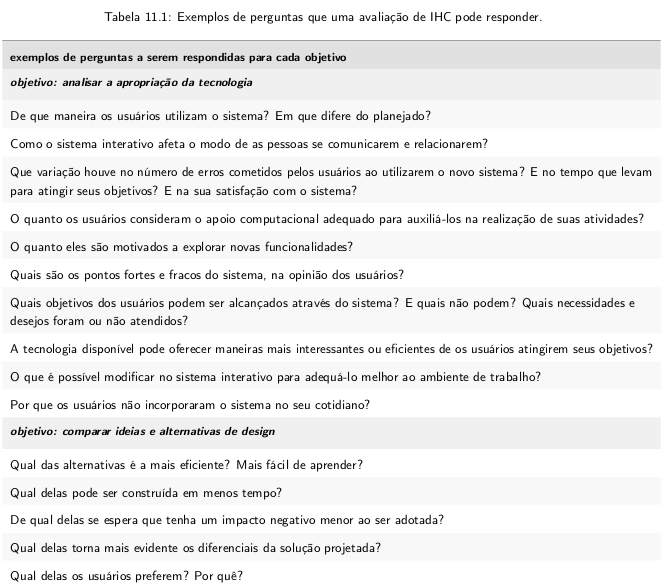

## Capítulo 11 - Planejamento da Avaliação de IHC (Barbosa)

<ol>

<li> Por que avaliar? </li>

- Identificar e resolver os problemas de IHC antes do produto ser lançado;
- A equipe de desenvolvimento pode se concentrar na solução de problemas reais, ao invés de gastar tempo debatendo gostos e preferências particulares de cada membro da equipe a respeito do produto;
- Os engenheiros não estão em uma posição adequada para discutir sobre a qualidade de uso;
- O tempo para colocar o produto no mercado diminui, já que os problemas de IHC são corrigidos desde o início do processo de desenvolvimento;
- Identificar e corrigir os problemas de IHC permitem a entrega de um produto mais robusto.

<li> O que avaliar? </li>

- Objetivos da avaliação

- Pessoas a quem esses objetivos interessam (stakeholders): é importante ter um grupo amplo, para ter uma visão melhor do que deve ser avaliado.

Os principais aspectos a serem avaliados:

- Apropriação de tecnologia pelos usuários:
  - Capacidade do usuário em realizar as tarefas rapidamente;
  - Menor quantidade de erros;

- Ideias e alternativas de design:
  - Facilidade de aprendizado, apoio à recuperação de erros ou o tipo de interação pretendido.

- Conformidade com um padrão
  - Verificar se a solução segue os padrões do ambiente computacional em que será inserida (ex: GNOME) e as especifidade do projeto.

- Problemas na interação e na interface:
  - Os problemas identificados são classificados de acordo com a gravidade, frequência e os fatores que compõe os critérios de uso prejudicados (como usabilidade).

Para verificar se os objetivos foram atendidos, é possível utilizar as seguintes perguntas de exemplo:

<li> Quando avaliar o uso de um sistema? </li>

Existem duas formas de avaliar:

- Avaliação formativa: durante o processo de design, facilita as alterações e correções.
- Avaliação somativa: ocorre ao final do processo, quando existe uma solução (parcial ou completa) de interação e interface pronta.

<li> Onde coletar dados sobre experiências de uso? </li>

A interação usuário-sistema é afetada pelo contexto de uso, que abrange o espaço físico, social e cultural em que ela ocorre. As avaliações podem ser feitas em contexto real de uso ou em laboratório.

A avaliação em contexto aumenta as chances de verificar-se a qualidade de uso da solução de IHC perante um conjunto maior e mais diversificado de situações de uso, mas não é capaz de analsiar todas as situações de uso possíveis.

A avaliação em laboratório oferece um controle maior sobre as interferências do ambiente na interação usuário-sistema e facilita o registro de dados das experiẽncias de uso.

<li> Que tipo de dados coletar e produzir? </li>

Os dados coletados e produzidos em uma avaliação de IHC podem ser classificados de diferentes maneiras, como:

- Nominais ou categóricos: representam conceitos na forma de rótulos ou categorias. Exemplo: uma pessoa pode ser classificada conforme a sua origem étnica, e pode ser atribuído um número à categoria sem perda de informação. Não existe relação de ordem e comparação entre esses dados.

- Ordinais: definem algum tipo de ordem entre eles, por exemplo a relação entre os

- Qualitativos: representam conceitos que não são representados numericamente, como respostas livres coletadas em questionários e entrevistas.

- Quantitativos: representam numericamente uma quantidade, tais como o tempo e o número de passos para realizar uma operação.

<li> Qual tipo de método de avaliação escolher? </li>

Os métodos podem ser classificados em:

- Métodos de investigação (inquiry): envolvem o uso de questionários, entrevistas, grupos de foco e estudos de campo, dentre outros. Permite ao avaliador ter acesso, interpretar e analisar concepções, opiniões, expectativas e comportamentos do usuário relacionados com sistemas interativos. Não exigem que o usuário tenha usado o sistema recentemente.

- Métodos de observação: fornecem dados sobre situações em que os usuários realizam suas atividades, com ou sem apoio de sistemas interativos. O avaliador pode observar os usuários em contexto ou em laboratório.

- Métodos de inspeção ou analíticos: o examinador tenta antever as possíveis consequências de certas decisões de design sobre as experiências de uso. Não envolvem diretamente os usuários, portanto, tratam de experiências de uso potenciais e não reais. São mais rápidos e possuem menor custo em relação aos que envolvem usuários.

Os objetivos da avaliação são os guias principais para o avaliador escolher os métodos de avaliação a serem utilizados, exemplos:
Se o objetivo da avaliação for encontrar problemas de
IHC, o avaliador pode julgar mais adequado empregar um método por inspeção para cobrir (quase) toda
a interface, e selecionar um pequeno número de partes importantes a serem avaliadas por um método
de observação ou de investigação. Geralmente, ele selecionaria as partes cuja inspeção não forneceu
resultados suficientemente confiáveis. Já avaliar a forma como os usuários se apropriam de tecnologia
requer o emprego de um método de avaliação através de investigação ou de observação, por contar com a
participação dos usuários. E, para avaliar a conformidade com um padrão, é mais adequado empregar um
método de avaliação por inspeção, pois a participação dos usuários é desnecessária.

<li> Como avaliar? </li>

- Por onde começar?

  - Aprender sobre a situação atual que inclui o domínio do problema, os papeis e perfis dos diferentes grupos de usuários, seus objetivos e atividades, e o contexto em que o sistema é ou será utilizado.
  - Conhecer as interfaces dos sistemas complementares ou semelhantes com os quais os usuários estejam acostumados a usar.

- Preparação
  - Objetivos são definidos com base nas requisições, reclamações ou comportamentos dos stakeholders do sistema.
    - Os objetivos devem ser detalhados através de questões mais específicas que a avaliação deverá responder.
    - Raramente avalia-se o sistema inteiro, em vez disso define-se o escopo da avaliação.
    - Escolher um ou mais métodos, de acordo com os objetivos da avaliação e os recursos disponíveis.
    - Escolher o perfil e o número de participantes, levando em consideração o público alvo da solução proposta.
    - Questões práticas, como alocação de pessoal, recursos e equipamentos e preparação de material de apoio. Uma avaliação com usuários requer a preparação do ambiente de teste, a realização de um teste-piloto (pela equipe) e o recrutamento dos participantes, além de envolver questões éticas.
    - Preparar e imprimir o material de apoio necessários.

No caso de avaliações que envolvam participantes, o material costuma incluir:

    - Termo de consentimento livre e esclarecido (TCLE) de acordo com os cuidados éticos necessários.
    - Questionário pré-teste para coletar informações dos participantes que podem influenciar a interação usuário-sistema.
    - Roteiro de entrevista pós-teste para coletar informações sobre a opinião e os sentimentos do participante.
    - Instruções e cenários para orientar os participantes sobre as tarefas a serem realizadas;
    - Roteiro de acompanhamento da observação, de movo a facilitar a captura de dados e anotações.

Após planejar a avaliação, o avaliador deve realizar um teste-piloto, para avaliar o planejamento e a avaliação. O teste deve ser conduzido como uma sessão normal de avaliação.

O avaliador deve evitar selecionar pessoas conhecidas para as avaliações.

- Consolidação e Relato dos Resultados

  - Os avaliadores buscam recorrências nos dados;
  - A generalização dos resultados exige muito cuidado;

  - Os resultados são indicativos de tendências de problemas, mas não uma garantia.
  - A ausência de problemas não indica necessariamente uma alta qualidade de uso, apenas que não houveram problemas no escopo do sistema que foi avaliado em um certo planejamento.
  - É necessário relatar o resultados, geralmente incluindo:
    - objetivos e escopo da avaliação;
    - método de avaliação empregado;
    - número e o perfil de usuários que participaram da avaliação;
    - sumário dos dados coletados, por meio de tabelas e gráficos;
    - relato da interpretação e análise dos dados;
    - lista dos problemas encontrados;
    - planejamento para o reprojeto do sistema.

<li> O framework DECIDE </li>

O framework serve para orientar as etapas da avaliação. As   atividades são interligadas e executadas iterativamente, à medida que o avaliador articula os objetivos da avaliação, os dados e recursos disponíveis. Caso os objetivos sejam revistos, as atividades serão afetadas.

As atividades do framework são as seguintes:

- D: Determinar os objetivos da avaliação.
- E: Explorar perguntas a serem respondidas com a avaliação.
- C: Choose (escolher) os métodos de avaliação a serem utilizados.
- I: Identificar e administrar as questões práticas da avaliação.
- D: Decidir como lidar com as questões éticas.
- E: Evaluate (avaliar), interpretar e apresentar os dados.

</ol>

<!-- @TODO: responder. -->
## Lista de Exercícios nº 2

### Explique as vantagens de avaliar a qualidade de uso?

### Sob quais perspectivas um sistema interativo deve ser avaliado? Explique cada uma delas

### A avaliação de IHC deve ser conduzida pelos avaliadores que participaram da concepção da solução? Justifique a sua resposta

### Quais são as razões para se avaliar a qualidade de uso de sistemas computacionais interativos?

### Quais os benefícios a curto, médio e longo prazo de avaliar a qualidade de uso?

### O que se deve fazer no planejamento de uma avaliação?

### O que são os objetivos de uma avaliação, a quem eles interessam e por quê?

### O que significa avaliação de ideias e alternativas de design? Cite exemplos

### O que significa avaliação de conformidade com um padrão? Cite exemplos

### Cite exemplos de perguntas que uma avaliação deve responder em relação ao objetivo da avaliação

### Qual a diferença entre a avaliação formativa e somativa?

### Qual a diferença da avaliação de IHC em um contexto real de uso e em laboratório?

### Qual a diferença entre os métodos de investigação, inspeção e observação?

### Descreva a atividade de preparação da avaliação

### Apresente um modelo de termo de consentimento? Para que ele deve ser usado?

### Explique o que é um teste-pilot<li> Quem realiza o teste  </li>piloto?

### Qual o tempo máximo sugerido para um participando realizar uma tarefa na avaliação? Qual o tempo máximo sugerido para uma avaliação?

### Que informações devem ser colhidas no formulário de acompanhamento das sessões de observação?

### Explique como se faz para recrutar participantes para uma avaliação de design

### Quem o avaliador deve evitar para ser o participante da avaliação?

### Explique o framework Decide

### Como e em que momento o framework decide pode ser usado no projeto da disciplina
