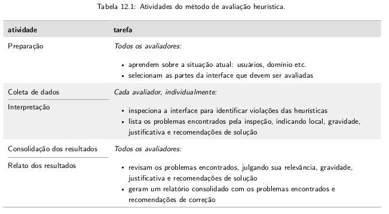
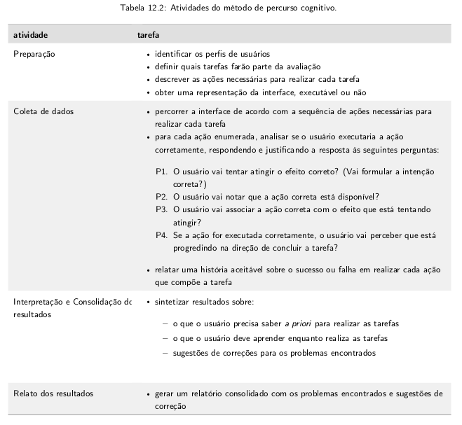
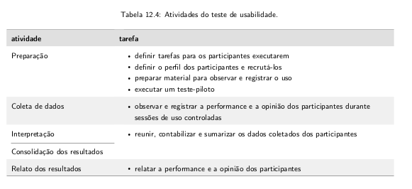
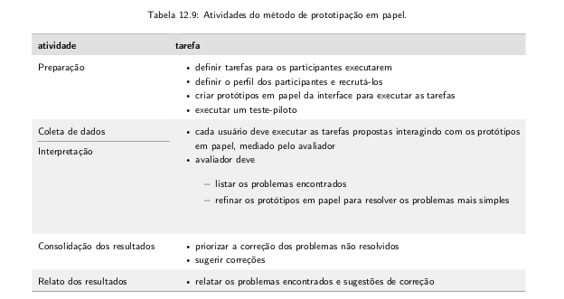

## Métodos de Avaliação de IHC

- Há métodos de avaliação por inspeção e por observação.

## Avaliação de IHC através de Inspeção

- O método se baseia em tentar **prever** as consequências das decisões de design;
- Não envolve diretamente os usuários, são baseadas em experiências de usos **potenciais**;
- Os avaliadores tentam se colocar no lugar de um usuário com determinado perfil, conhecimento e experiência em algumas atividades;

O capítulo apresenta três tipos de avaliação por inspeção:

### Heurística

Heurística significa a arte de inventar, fazer descobertas; Ciência que tem por objeto a descoberta das coisas.

No contexto da informática, a **heurística** define um método de investigação baseado na aproximação progressiva de um dado problema.

- Visa encontrar problemas de usabilidade;
- A interface é inspecionada sistematicamente;
- É mais rápida e de menor custo em relação aos métodos empíricos;
- Tem como base um conjunto de diretrizes de usabilidade, chamadas por Nielsen de **heurística**;
- Essas **heurísticas** são resultados da análise de mais de 240 problemas de usabilidade realizada por especialistas em IHC ao longo de vários anos;

Algumas das heurísticas são:

- **Visibilidade do estado do sistema**: feedbacks adequados e no tempo certo;
- **Correspondência entre o sistema e o mundo real**: palavras e expressões familiares aos usuários; Uso de convenções do mundo real, apresentação em ordem natural e lógica;
- **Controle e liberdade do usuário**: "saídas de emergência", opções de desfazer e refazer as ações.
- **Consistência e padronização**: palavras, situações e ações diferentes devem significar coisas diferentes. Deve-se seguir convenções da plataforma ou ambiente computacional.
- **Reconhecimento em vez de memorização**: simbologia intuitiva, partem de um estudo cultural.
- **Flexibilidade e eficiência de uso**: Atalhos, barras de navegação lateral.
- **Projeto estético e minimalista**: A interface não deve conter informação irrelevante ou raramente necessária, para não roubar a atenção do usuário.
- **Prevenção de erros**: O projeto deve ser projetado para evitar que um problema ocorra.
- **Ajude os usuários a reconhecerem, diagnosticarem e se recuperarem de erros**: indicar precisamente o problema e sugerir uma solução de forma construtiva.
- **Ajuda e documentação**: Fornecer ajuda e documentação de alta qualidade.

Atividades do método de avaliação:

- A avaliação deve ter entre três e cinco avaliadores.
- O avaliador deve percorrer a interface pelo menos duas vezes: uma para ganhar uma visão de conjunto e outra para examinar cuidadosamente cada elemento de cada tela.

Para cada problema identificado, o avaliador deve anotar:

- Qual diretriz foi violada
- Em que local o problema foi encontrado: quais partes da interface devem ser modificadas. O problema pode ser:
  - Pontual
  - Ocasional
  - Sistemático
  - Ausência de algum elemento
- Qual a gravidade do problema: leva em consideração os fatores:
  - Frequência com que o problema ocorre
  - Impacto do problema: facilidade de recuperação
  - Persistência do problema
  E é classificado em:
  - Problema cosmético
  - Problema pequeno
  - Problema grande
  - Problema catastrófico
- Justificativa de porque aquilo é um problema
- É interessante anotar ideias de soluções alternativas

### Percurso cognitivo

- Avalia a facilidade de aprendizado de um sistema, através da exploração da sua interface.
- Foi motivado pela preferência de muitas pessoas em aprender fazendo.

- As tarefas podem ser avaliadas em qualquer etapa do desenvolvimento.
- O avaliador simula a execução das tarefas que fazem parte do escopo de avaliação.
- Para a avaliação de cada passo, o avaliador responde as seguintes perguntas:

P1. O usuário tentaria atingir o efeito corretor? A formulação da intenção do usuário seria a espera pelo designer do sistema? Se a ação faz parte da tarefa tal qual como concebida pelo usuário, ele tem mais chance de formular a intenção correta.
P2. O usuário perceberia que a ação correta está disponível? Geralmente ele sabe se há uma representação da ação na interface.
P3. O usuário conseguiria associar a ação correta com o efeito que está tentando atingir? Isso é facilitado quando o usuário tem experiência com sistemas semelhantes, se a interface comunica a associação entre ação e o efeito esperado ou por eliminação.
P4. Se a ação correta for realizada, o usuário perceberia que está progredindo para concluir a tarefa? Facilitadores: semelhança com outros sistemas e respostas do sistema.

- Todas as perguntas devem ser respondidas para cada ação, mesmo em caso de insucesso, o avaliador deve considerar a possibilidade de o usuário ter conseguido avançar.

### Inspeção semiótica

## Avaliação de IHC através de Observação

### Testes de usabilidade

### Método de avaliação de comunicabilidade

### Prototipação em papel

---

## Lista de Exercícios

- Parte 1

1. O que é o método de avaliação heurística?

2. Quais são as heurísticas descritas por Nielsen que podem ser utilizadas no método de avaliação heurística? Essas heurísticas são suficientes para avaliar todos os outros tipos de interface? Justifique a sua reposta.
3. Quantos avaliadores devem estar envolvidos na avaliação heurísticas, baseado na recomendação de Nilsen?
4. Quais são as atividades e tarefas de cada uma atividade envolvidas no método de avaliação heurísticas?
5. Na avaliação heurística, o que o avaliador deve anotar para cada problema identificado?
6. Quais são os fatores que influenciam o avaliador no julgamento da severidade de um problema de usabilidade encontrado?
7. Nielsen sugere qual escala de severidade para facilitar a compreensão e comparação do julgamento dos problemas encontrados?
8. Em torno de quanto tempo deve durar uma sessão de inspeção de interface na avalição heurística? Justifique a sua resposta.
9. O que geralmente deve conter no relato dos resultados de uma avaliação heurística?
10. Quais são as atividades e tarefas de cada uma atividade envolvidas no percurso cognitivo? Quantos avaliadores podem realizar a avaliação no percurso cognitivo? Como eles devem atuar na avaliação?
11. O que consiste os objetos do estudo e o material de apoio na atividade de preparação na avaliação no percurso cognitivo?
12. Quais são as perguntas que devem ser respondida em cada passo da avaliação?
13. O que o relatório deve contar para cada tarefa analisada?
14. O que é teste de usabilidade e qual o seu objetivo?
15. O que deve ser feito para realizar as medições desejadas no teste de usabilidade?
16. Quais são as atividades e tarefas de cada uma atividade envolvidas no teste de usabilidade?
17. Na atividade de coleta de dados, o que são coletados nos nessa atividade? Cite exemplos.
18. Como um teste de usabilidade pode auxiliar na avaliação de uma meta de usabilidade que define que um tarefe deve ser realizada em até 5 minutos?
19. Como um teste de usabilidade pode ser empregado para fornecer resultados qualitativos?
20. O que o relato dos resultados do teste de usabilidade deve descrever?
21. Por que Jakob Nielsen afirma que são necessários apenas 5 usuários para fazer um teste de usabilidade?
