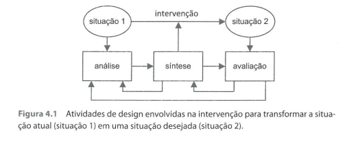
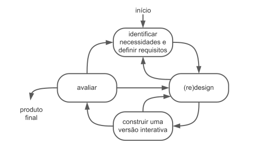
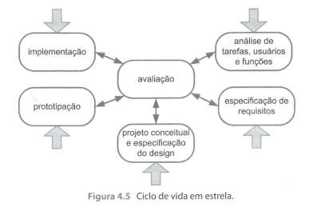
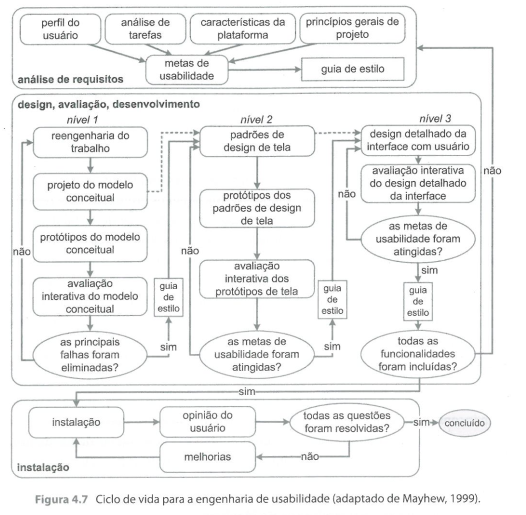

Lista de Exercícios

1. O que é um artefato?

    - São produtos artificiais, frutos da inteligência e do trabalho humano, construídos com um determinado propósito em mente. Um artefato não surge espontaneamente na natureza.

2. Quais são e explique as três atividades básicas do processo de design de IHC?

    - Análise da situação atual: estudar e interpretar a situação atual.
    - A síntese de uma intervenção: planejar e executar uma intervenção na situação atual.
    - A avaliação da nova situação: verificar o efeito da intervenção, comparando a situação analisada anteriormente com a nova situação, atingida após a intervenção.

    

3. O que é uma intervenção?

    - Uma intervenção é a resposta para um problema a ser resolvido: "Como melhorar essa situação?". Também pode ser chamada de solução.

4. Quais pontos do processo de desenvolvimento a avaliação de uma intervenção pode ocorrer?

    - Durante a concepção e o desenvolvimento da intervenção, para tentar prever seus possíveis impactos na situação atual.
    - Logo antes da introdução da intervenção, para identificar as consequências negativas ou problemas que possam ser evitados.
    - Depois da intervenção ter sido aplicada, para verificar os impactos ocorridos.

5. Cite alguns aspectos a serem avaliados quando a intervenção envolve um sistema interativo?

    - Existem vários aspectos a serem avaliados, como a facilidade de manutenção e robustez, a usabilidade e acessibilidade.

6. O que é o design sob uma perspectiva de racionalismo técnico?

    - Nessa perspectiva, o designer pressupõe que há soluções conhecidas, ou métodos bem definidos e precisos para gerá-las, para um determinado problema.
    - As soluções esperadas certamente serão produzidas se os métodos forem seguidos.
    - As soluções e métodos empregam leis, princípios, normas e valores, geralmente estabelecidos pela natureza, com base em disciplinas de ciências naturais e exatas.
    - A atividade de designe se resume a enquadrar uma situação num tipo geral de problema cuja forma de solução seja conhecida.
    - Não há espaço para o designer questionar ou mudar as verdades estabelecidas pelas relações de causa e consequência.

7. O que é o design sob uma perspectiva de reflexão em ação?

    - Nessa perspectiva, uma situação do cotidiano pode estar associada a um problema, que é considerado único.
    - Cada caso é diferente do outro, logo, o processo de design e a solução encontrada também são únicos.
    - O designer não procura descobrir dicas para uma solução padrão e sim características particulares de uma situação tida como problemática e, a partir dessa descoberta gradual, projeta uma intervenção.
    - Assemelha-se ao processo de pesquisa científica, passando pela construção de uma hipótese, experimentação e avaliação.

8. O que é processo de design?

    - O processo de design envolve as seguintes atividades básicas: análise da situação atual, síntese de uma intervenção e avaliação dessa intervenção projetada ou já aplicada à situação atual.
    - As atividades são executadas de forma iterativa, permitindo refinamentos.

9. O que é design dirigido pelo problema?

    - Despende mais tempo analisando a situação atual, as necessidades e as oportunidades de melhoria.

10. O que é design dirigido pela solução?

11. A quem os processos de design de IHC buscam atender e servir?

12. Quais são os princípios de um processo centrado no usuário?

13. No ciclo de vida simples, quantas vezes devem ocorrer a iteração entre as atividades?

    - A iteração entre as atividades ocorre quantas vezes forem necessárias.
    - É simples por não ser detalhado, por este motivo é mais recomendado para quem já tem alguma experiência em avaliação.
    

14. Idealmente, quando o processo de design deve ser concluído?

15. O que é o produto final do processo de design?

16. Qual a diferença entres os diversos processos de design de IHC?

17. Sobre o ciclo de vida em estrela, por qual atividade o designer deve realizar primeiro? Qual a
única exigência desse ciclo de vida?

    - O designer pode começar por qualquer uma das pontas.
    - A única exigência é que, após concluir cada atividade, o designer avalie os resultados obtidos para verificar se ele encontrou ou está no caminho de encontrar uma solução satisfatória.
    
    

18. Sobre a Engenharia de Usabilidade de Nielsen, quais são as atividades desse ciclo de vida? Explique cada uma delas.

    - **As atividades propostas são:**

    - Conheça seu usuário: estudar os usuários (e demais stakeholders) e os usos do produto.
    - Realize uma análise competitiva: examinar produtos com funcionalidades semelhantes ou complementares.
    - Defina as metas de usabilidade: definir os fatores de qualidade de uso que devem ser priorizados no projeto, como serão avaliados e quais faixas de valores estão de acordo, para cada indicador de interesse.
    - Faça designs paralelos: elaborar diferentes alternativas de design, de preferência de 3 a 4 designers trabalhando de forma independente.
    - Adote o design participativo: consiste em a equipe de design ter acesso permanente a um conjunto de usuários tidos como representativos da população-alvo de usuários.
    - Faça o design coordenado da interface como um todo: é importante haver um responsável pelo design coordenado da interface como um todo, o que inclui interface e documentação, sistema de ajuda e etc.
    - Aplique diretrizes e análise heurística: Nielsen sugere que a equipe siga diretrizes, princípios bem conhecidos para o design da interface.
    - Faça protótipos.
    - Realize testes empíricos.
    - Pratique design iterativo.

19. Sobre Engenharia de Usabilidade Mayhew, quais são as três fases desse processo iterativo? Explique cada uma delas.

    - Análise de requisitos: definição das metas de usabilidade e do guia de estilo.
    - Design, avaliação e desenvolvimento:
    - Instalação.
    
