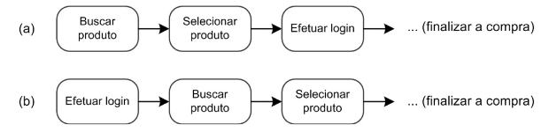
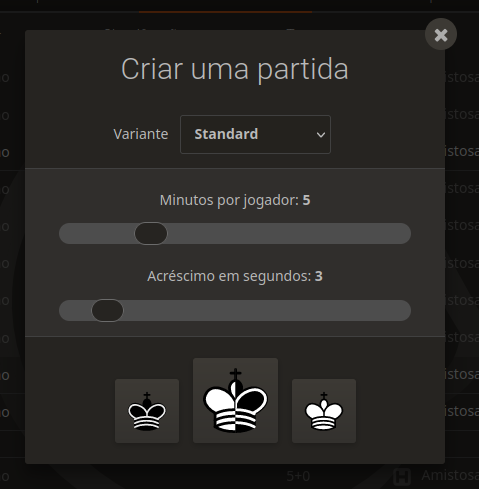
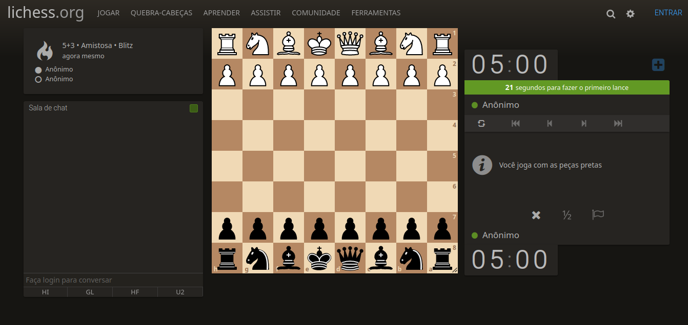
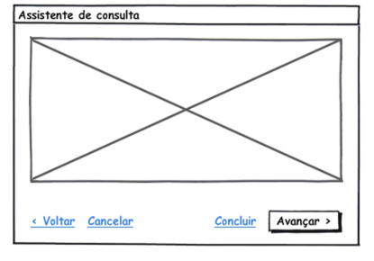
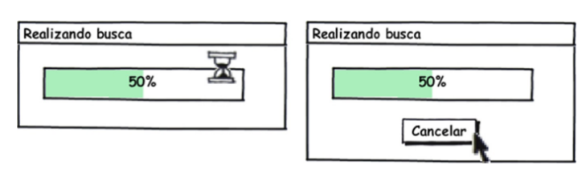
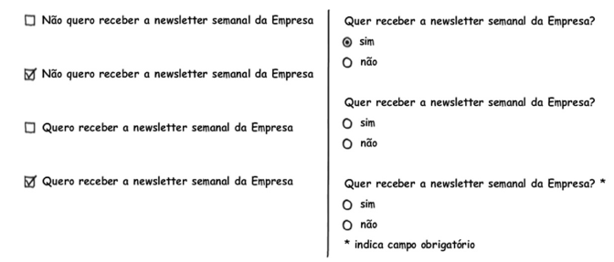
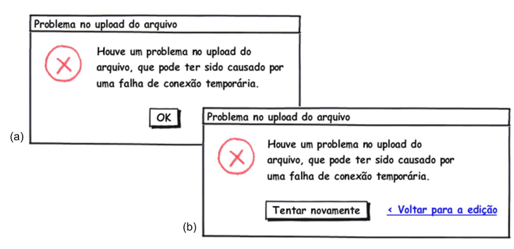

# Princípios e Diretrizes

## Lista de Exercícios

Estudante: Nicolas Chagas Souza  
Matrícula: 20/0042327

### 1. O que são princípios, diretrizes (guidelines) e padrões na literatura de IHC?

Princípios representam objetivos gerais e de alto nível, diretrizes são regras gerais que podem ser observadas na prática e padrões são soluções específicas a certos contextos bem delimitados, envolvendo certos usuários desempenhando determinadas tarefas.
Fonte: [1]

### 2. Cite alguns ambientes de trabalho para onde as diretrizes são desenvolvidas?

Algumas diretrizes são desenvolvidas especificamente para certos ambientes de trabalho, como o Windows, MacOS e o Gnome.

Fonte: [1]

### 3. O que é uma lista de verificação (checklists)?

São listas de verificações utilizadas por inspetores para examinar uma interface e sua conformidade em relação a um conjunto de diretrizes.

Fonte: [1]

### 4. O que é ErgoList?

A ErgoList é uma lista brasileira de verificações (checklist) desenvolvida com base em princípios de ergonomia.

Fonte: [1]

### 5. Quais são os tópicos que os princípios e diretrizes utilizados em IHC geralmente abordam? Explique cada um deles

Os princípios e diretrizes englobados são:

- **Correspondência com as expectativas dos usuários:** o sistema deve estar de acordo com o que o usuário espera, principalmente de outros sistemas semelhantes e interações na vida física.
- **Simplicidade nas estruturas das tarefas:** não deve ser difícil e trabalhoso realizar tarefas, e tarefas semelhantes devem ter caminhos semelhantes.
- **Equilíbrio entre controle e liberdade do usuário:** o usuário deve estar em controle do sistema, podendo refazer suas ações e sair das interações a qualquer momento, mas não deve ter liberdade suficiente para cometer erros irreversíveis.
- **Consistência e padronização:** a interface deve apresentar uma padronização de ações e respostas, para que o usuário possa encontrar facilmente as funcionalidades desejadas.
- **Promoção da eficiência do usuário:** o usuário deve ser mantido em constante atividade ao utilizar o sistema, e recursos como atalhos e realização de tarefas demoradas em background pode aumentar a eficiência do usuário.
- **Antecipação das necessidades do usuário:** o sistema deve prever os passos do usuário para otimizar a sua utilização.
- **Visibilidade e reconhecimento:** o usuário deve ser capaz de ver o estado do sistema durante toda sua utilização, e também deve ser capaz de se orientar no sistema por reconhecimento em detrimento da memorização.
- **Conteúdo relevante e expressão adequada:** as informações presentes nas interações devem ser concisas e consistentes com a interação, o excesso de informação pode diminuir a relevância relativa dos elementos que deveriam ter destaque.
- **Projeto para erros:** os erros que podem ser cometidos durante o uso do sistema deve ser previsto pelo designer e o projeto deve minimizar essas possibilidades, provendo opções de recuperação para o caso em que estes ocorram.

Fonte: [1]

### 6. Qual opção, (a) ou (b), da figura a seguir deve ser construído em um sistema? Justifique a sua resposta baseada em tópico de princípios e diretrizes de IHC

A primeira opção (a) está mais próxima da realidade do usuário ao frequentar uma loja física, adequando-se melhor a correspondência com as expectativas do usuário. Ao entrar em uma loja física, o cliente pode buscar por produtos, escolher um e só então efetuar um cadastro para comprá-lo, efetuar um cadastro antes da busca não é um fluxo natural e por isso não corresponde às expectativas do usuário.

Fonte: [1]

### 7. Como podemos simplificar a estrutura das tarefas?

É possível simplificar a estrutura da tarefa fornecendo diversas formas de apoio para que os usuários possa aprender a realizá-la, melhorando o _feedback_ visual durante a realização dela e, consequentemente, aumentando o controle do usuário sobre a tarefa, automatizando uma de suas partes ou modificando-a por completo, alterando a sua natureza.

Fonte: [1]

### 8. Por que se deve manter o usuário no controle?

Quando está no controle, o usuário aprende rapidamente e ganha mais confiança ao utilizar o sistema. Esse controle deve ser fornecido com um equilíbrio, pois seu excesso pode desorientar os usuários, como por exemplo com o excesso de opções.

Fonte: [1]

### 9. Quantos caminhos os usuários devem poder fazer para realizar uma atividade? Dê um exemplo de caminho(s) para realizar uma atividade

É importante fornecer ao usuário opções de caminho, um deles deve ser o preferencial, e além destes e suas variações, devem ser oferecidas opções de saída clara e rápida. A saída não pode ser o caminho preferencial, e optar por ela deve resultar em um caminho com alguma resistência, para prevenir falhas. É importante que o usuário possua uma controle local das interações durante uma atividade, sendo o iniciador da interação e podendo cancelar, desfazer e refazer suas ações.

Caminhos possíveis na plataforma Lichess para iniciar uma partida de xadrez:

**1º Caminho:** para iniciar uma partida o usuário deve clicar no botão "Iniciar uma Partida" na tela inicial, o que acarretará na abertura de uma tela de configuração, cuja saída é indicada por um "x" no topo da janela (Figura 1), após configurar a partida, o usuário deve clicar em uma das peças de xadrez para escolher a cor das suas peças o que o levará para a tela de jogo (Figura 2), onde a saída não está em destaque, pois encontra-se no menu lateral abaixo da mensagem informativa "Você joga com as peças pretas".

Figura 1: Configuração de partida na plataforma Lichess. (Fonte: lichess.org)

Figura 2: Tela de jogo. (Fonte: lichess.org)

**2º Caminho:** para iniciar uma partida o usuário deve acessar o menu "jogar" e escolher o modo de jogo, caso opte por criar uma partida, o que também acarretará na abertura da tela de configuração e o fluxo seguirá exatamente como no primeiro caminho.

No exemplo da plataforma Lichess não constam as opções de desfazer e refazer as interações referentes à configuração da partida. O ideal seria incluir uma tela de confirmação com as opções selecionadas, da qual o usuário poderia voltar para a tela anterior para refazer ou alterar as configurações feitas e até mesmo cancelar a solicitação para iniciar partida.

Fonte: [1]

### 10. Explique todos os elementos (opções) da figura seguir baseado no Equilíbrio entre Controle e Liberdade do Usuário

A opção voltar fornece ao usuário o controle caso deseje alterar alguma opção antes de prosseguir, ou seja, fornece a opção de refazer suas ações. A opção cancelar fornece uma saída clara e rápida ao usuário. A opção concluir termina a tarefa de uma maneira diferente da forma preferencial, dando liberdade ao usuário. A opção avançar compõe o fluxo padrão da atividade e por este motivo encontra-se destacada.

### 11. Entre as duas telas seguir, qual deve ser implementada em um sistema? Justifique a sua resposta baseada em tópico de princípios e diretrizes de IHC. Qual a vantagem de oferecer esse tópico ao usuário?

A segunda tela, com a opção de cancelar. A diretriz a ser seguida é a de liberdade do usuário, pode ocorrer algum erro durante a busca solicitada que cause uma grande demora ou, ainda, o usuário pode perceber que cometeu algum equívoco na solicitação e deseje cancelar a busca.

### 12. O que se pode fazer para facilitar o aprendizado e uso de um sistema?

Fornecer caminhos alternativos para completar tarefas facilita o aprendizado de uso de um sistema para usuários que preferem aprender na prática. A consistência da interface também contribui para facilitar o aprendizado.

Fonte: [1]

### 13. O que devemos padronizar em um sistema? Cite exemplos

Ações, resultados das ações, o _layout_ dos diálogos e as visualizações de informação. Por exemplo, ações semelhantes devem seguir caminhos semelhantes, ações relacionadas ao arquivo no editor VsCode encontram-se todas no menu "Arquivo", então caso o usuário deseje efetuar alguma operação com arquivo, seja sua abertura, salvamento ou criação de um novo arquivo, seguirá o mesmo caminho. Os resultados dessas ações também devem ser padronizados, ou seja, se a criação de um arquivo resulta na abertura de uma janela de diálogo confirmando a escolha, espera-se que a operação de abertura de arquivo siga o mesmo padrão.

Fonte: [1]

### 14. Cite exemplos de como o sistema pode promover a eficiência do usuário segundo Toganzzini, Cooper, Nielsen e Shneiderman?

É importante manter o usuário ocupado, pois a espera pelo resultado de algum processamento por parte do computador pode frustrar ou entediar o usuário, causando perda de dinheiro e produtividade. Para isso, é recomendável deixar processamentos demorados ocorrendo em _background_ enquanto o usuário continua executando suas atividades. O sistema deve ser sensível ao que o usuário está fazendo e evitar que ocorram interrupções durante a realização de tarefas, além disso o trabalho do usuário deve ser protegido, os usuários jamais devem perder o trabalho realizado por falhas como falta de rede ou energia. O sistema deve gravar as opções do usuário, ou seja, o usuário não deve ter que responder as mesmas perguntas várias vezes, como por exemplo o tema da interface escolhido na plataforma Teams. O usuário deve ser capaz de recuperar o ponto onde parou o sistema ao utilizá-lo em outra máquina. A utilização de atalhos e fornecimento de opções padrão para ações frequentes também promove a eficiência do usuário.

Fonte: [1]

### 15. O que antecipação em um sistema?

O sistema deve tomar a iniciativa e fornecer informações adicionais úteis, essa iniciativa baseia-se em uma previsão das necessidades do usuário. Caso o sistema não esteja processando nenhuma informação, ele pode adiantar operações que o usuário provavelmente realizará em seguida.

Fonte: [1]

### 16. Verifique se cada alternativa apresentada na figura a seguir é eficiente, neutra ou induz uma determinada opção?

Dentre as opções do lado esquerdo todas são eficientes, sendo que a primeira é neutra, a segunda induz a ação de não receber a _newsletter_, a terceira é neutra e a última induz a ação de receber a _newsletter_. Dentre as opções do lado direito, a primeira é eficiente e induz a ação de receber a _newsletter_, a segunda é eficiente e não induz a ação e a última é ineficiente e não induz ação.

### 17. Como projetar a visibilidade e reconhecimento em um sistema? Cite exemplos

A interface deve conter opções que estejam alinhadas com as intenções do usuário. A interface não deve exibir elementos que não façam sentido naquele contexto ou que não estejam disponíveis no momento da interação. Após a execução de uma ação, a interface deve fornecer indicações do estado do sistema ao usuário, de forma que este perceba as consequências da ação realizada e possa interpretá-las. Por exemplo, um ícone de notificações com um contador de mensagens não lidas fornece a visualização do estado do sistema de forma simples e compacta. Outro exemplo é o fornecimento de mensagens de _feedback_ após envio de formulários, apresentação da tela de carregamento durante requisições.

Fonte: [1]

### 18. Em relação ao tempo de espera, como Tognazzini sugere que o sistema deve fornecer feedback ao usuário?

A resposta do sistema deve ser adequada e no tempo correto. O tempo ideal para o feedback visual ou sonoro é de até 50 ms após um clique de botão. Ampulhetas podem sinalizar que o sistema não está travado, durante uma requisição que demore entre 0,5 s e 2 s. Quando a ação demorar mais do que 2 segundos, uma mensagem indicando a demora para cada passo sendo realizado deve ser exibida, juntamente com uma barra de progresso e opções de cancelamento. Ações que demorem mais do que 10 segundos (demoradas) devem possuir um _feedback_ de finalização, como uma indicação visual destacada ou sinalização sonora.

Fonte: [1]

### 19. O que significa “projeto estético e minimalista” de Nielsen?

Nielsen afirma que os diálogos não devem conter informações que sejam irrelevantes ou raramente necessárias, já que cada unidade extra de informação compete com as informações mais relevantes e reduz a visibilidade relativa delas.

Fonte: [1]

### 20. O que significa “projetar para o erro” de Nielsen? Como fazer isso?

Significa elaborar um projeto de IHC prevendo que qualquer erro potencial será cometido, para que o designer possa propor soluções de recuperação ao usuário em caso de erros. Não é recomendável colocar ações perigosas perto de ações frequentes em menus.

Fonte: [1]

### 21. Qual das duas telas, (a) ou (b), a seguir deve ser implementada em um sistema? Justifique a sua resposta

A tela (b) apresenta uma mensagem de feedback ao usuário e a oportunidade de recuperação, por meio da opção tentar novamente, e retomada de um caminho de interação, por meio da opção voltar para edição.

### 22. O que é Padrões de Design de IHC? Cite um exemplo

Padrões de Design propõem soluções padronizadas para problemas comuns. Um exemplo de padrão de design de interface é o Acordeão, menu lateral que pode ser colapsado, muito utilizado em diversas interfaces. Ele pode ser descrito pelos seguintes elementos:

| Elemento | Descrição |
| - | - |
| **Título** | Acordeão |
| **Problema** | O usuário precisa encontrar um item dentre as opções de navegação |
| **Solução**| Empilhar painéis vertical ou horizontalmente, abrindo um painel por vez e colapsando os demais |
| **Usar quando**| Como mecanismo de navegação, equivalente a guias e substituto à árvores de navegação.|
| **Como**| Os painéis são dispostos verticalmente ou horizontalmente, sendo apenas um deles aberto por vez. Em geral, painéis verticais destinam-se aos submenus e horizontais, a grandes áreas de conteúdo. Alguns cuidados devem ser tomados: <li>Animar a abertura dos painéis de forma sutil, no máximo 250 ms.</li> Permitir que a navegação seja feita pelas setas do teclado. <li> Destacar o painel atual. </li> O tamanho total do Acordeão deve aumentar ou diminuir para acomodar o conteúdo adequadamente |
| **Porquê**| Para comprimir muitos elementos em um espaço reduzido da tela. |
| **Exemplo**|  |

Tabela 1: Descrição do Acordeão. Fonte: [1]

Fonte: [1]

## Bibliografia

[1] Barbosa, S. D. J.; Silva, B. S. da; Silveira, M. S.; Gasparini, I.; Darin, T.; Barbosa, G. D. J. (2021) Interação Humano-Computador e Experiência do usuário. Autopublicação. ISBN: 978-65-00-19677-1.
