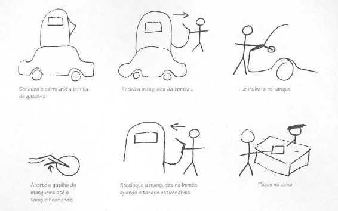

# Prototipação

1. Qual a diferença entre o design conceitual e físico?

    O design conceitual descreve os comportamentos e propósitos de um sistema, e o físico, detalhes do design como telas e ícones.

2. Quais são as duas circunstâncias distintas para o design?

    Iniciar um sistema do zero e evoluir um já existente.

3. O que é um protótipo?

    Algo que fornece aos stakeholders a possibilidade de interagir com o produto imaginado para adquirir alguma experiência de como usá-lo em um ambiente real e a explorar os usos imaginados.

    É uma representação limitada de um design que permite aos usuários interagir com ele e explorar sua conveniência.

4. Apresente os exemplos de protótipo do PalmPilot e da Impressora a Laser.

    O protótipo do PalmPilot era um pedaço de madeira esculpido. Para a impressora, a prototipação foi feita com uma caixa de papelão com o rótulo "impressora a laser".

5. Para quais fim serve um protótipo?

    - Testar a viabilidade técnica de uma ideia
    - Esclarecer requisitos vagos
    - Realizar testes e avaliação com usuários
    - Verificar que o design está compatível com o resto do sistema

6. O que são protótipos de baixa-fidelidade?

    São aqueles que não se assemelham muito ao produto final, utilizam, por exemplo, materiais muito diferentes da versão final pretendida.

7. Quais as vantagens de utilizar protótipos de baixa-fidelidade?

    São simples, baratos e de rápida produção. Logo, são facilmente modificáveis oferecendo suporte à exploração de ideias alternativas. Servem para exploração e deixam o usuário mais a vontade para sugerirem mudanças.

8. O que é Storyboard? Apresente um exemplo de storyboard.

    É um tipo de protótipo de baixa fidelidade, consiste em uma série de desenhos mostrando como um usuário pode progredir em uma tarefa utilizando o produto que está sendo desenvolvido. Pode ser uma série de telas esboçadas no caso de um sistema baseado em GUI.

    
    Figura 1: Exemplo de storyboard. Fonte [1]

9. O que é e para que serve prototipação com fichas?

    É muito usada para desenvolvimento de websites. Cada ficha representa uma tela ou elemento da tarefa. O usuário alterna os cartões fingindo realizar uma tarefa, enquanto interage com eles.

10. Quais são as vantagens e desvantagens da utilização de protótipos de baixa e alta-fidelidade?

    |  | Baixa fidelidade | Alta fidelidade |
    | - | - | - |
    | Vantagens | <ul><li>Custo mais baixo</li><li>Avalia múltiplos conceitos de design</li><li>Aborda layout de tela</li><li>Útil para identificar requisitos de mercado</li><li>Demonstração de que o conceito funciona</li></ul> |  <ul><li>Funcionalidade completa</li> <li> Totalmente interativo</li> <li>Uso conduzido pelo usuário</li> <li>Define o esquema de navegação</li> <li>Uso para exploração e teste</li><li>Mesma aparência do produto final</li><li>Serve como especificação viva</li><li> Ferramenta de venda e marketing</li> </ul>|
    | Desvantagens | <ul><li>Verificação limitada de erros</li><li>Pobre em detalhe para codificação</li><li>Utilidade limitada</li><li></li><li></li></ul>

11. O que é prototipação horizontal e vertical?

12. Apresente um Storyboard que apresente um pessoa executando
uma tarefa no sistema do seu projeto da disciplina. Escolha uma das atividades modeladas na Análise de Tarefas do projeto da
disciplina. Esse Storyboard deve conter uma parte textual descrevendo:
    - as pessoas envolvidas,
    - ambiente,
    - tarefas,
    - os passos envolvidos,
    - qual a motivação de usar a aplicação,
    - o que as pessoas precisam fazer para completar a tarefa,
    - o que motivou a usar o sistema.
    - o resultado (satisfação) da pessoa ao completar a tarefa no final do storyboard.

1. Faça um planejamento e realize a avaliação do Storyboard
referente ao exercício anterior. Apresente o relato dos
resultados. - Veja um exemplo de planejamento em Métodos de Avaliação de IHC através de Observação para Protótipos em
Papel (pág. 358)

1. O que é prototipação evolutiva e prototipação descartável?

2. O que é prototipação em papel?

3. Quais são as tarefas que devem ser realizadas na atividade de preparação da prototipação em papel?

4. Quais são as tarefas que devem ser realizadas na atividade de coleta e interpretação da prototipação em papel?

5. Quais são as tarefas que devem ser realizadas na atividade de consolidação dos resultados da prototipação em papel?

6. Quais são as tarefas que devem ser realizadas na atividade de relato dos resultados da prototipação em papel?

7. Qual a quantidade de avaliadores devem estar presentes na atividade de coleta de dados da prototipação em papel?

8. Durante a simulação, na atividade de coleta de dados da prototipação em papel, quais aspectos o observador deve ficar atento?

9. Na atividade de consolidação dos resultados da prototipação em papel, o que os avaliadores fazem?

10. Na atividade de relato dos resultados da prototipação em papel, o que os avaliadores devem informar?

11. Construa um protótipo de papel para o software do Storyboard do exercício número 12 da lista.

12. Faça um planejamento e realize a avaliação do protótipo de
papel referente ao exercício número 12 da lista. Apresente o
relato dos resultados. - Veja um exemplo de planejamento em Métodos de Avaliação de IHC através de Observação para
Protótipos em Papel (pág. 358)
